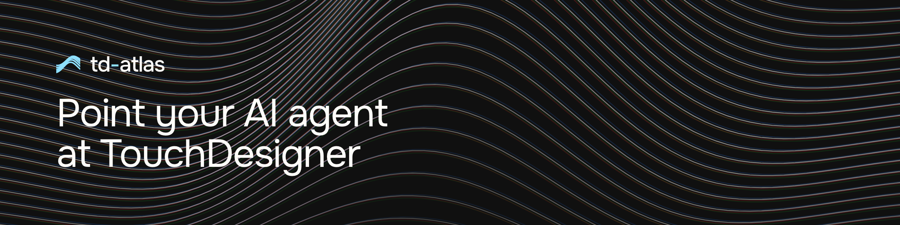

[English](README.md) | [Русский](README.ru.md) | 简体中文

<div align="center">
  <p align="center"></p>
  <h1>td-atlas</h1>
  <p>
    把 TouchDesigner 拆成原子的索引、通往运行中实例的实时桥，
    以及对已保存工程的离线读取 —— 通过 MCP 交给 AI 智能体。
  </p>
  <p>
    <a href="#安装">安装</a> ·
    <a href="#作为-mcp-服务器">在智能体里使用</a> ·
    <a href="plugin/skills/touchdesigner/references/tools.md">工具清单</a> ·
    <a href="docs/cli.md">命令行</a> ·
    <a href="docs/troubleshooting.md">排查</a> ·
    <a href="CHANGELOG.md">更新记录</a>
  </p>
  <p>
    <a href="https://github.com/grigabyte/td-atlas/actions/workflows/ci.yml"></a>
    
    
    <a href="LICENSE"></a>
  </p>
</div>

td-atlas 给智能体三样东西。来自*这台*机器的准确算子名和参数名。
伸进运行中实例的手，撤销只需一步。以及一种不打开就能读取已保存工程的办法。

## 它能做什么

- **[原子索引](docs/atom-index.md)** 分两遍从你自己那份程序里构建出一个
  SQLite 索引。索引里的值，就是那份程序报出的值。
- **[桥](docs/bridge.md)** 是一个 Web Server DAT 和一个回调 DAT，
  由脚本在你的工程里搭建。你可以读它，在 git 里看到它的改动，并就地升级它。
- **[TouchDesigner 不会报告的事](docs/health.md)**。`errors` 覆盖 TouchDesigner
  自己称之为错误的部分，`td_health` 覆盖它闭口不谈的那些损坏。
- **[调用日志](docs/journal.md)** 每次桥调用写一行，写在宿主机上，
  而且比会话活得更久。
- **[离线读取工程](docs/offline-projects.md)** 在 TouchDesigner 关闭时检查、
  搜索和比较一个工程，而原始文件原样不动。
- **[保存时写出的网络文本](docs/network-text.md)** 是桥可以在每次保存时
  放到 `.toe` 旁边的东西，于是工程在 git 里有了可 diff 的历史。

## 安装

先要有三样东西。

- **TouchDesigner**，已经装好。[索引](docs/atom-index.md)是从*你那份*程序里
  构建的，保存的是那份程序报出的值。没有什么需要下载。
- **Python 3.11 或更新版本**，装在宿主机上。
- **一个会说 [MCP](https://modelcontextprotocol.io) 的 AI 智能体**。
  调用这些工具的正是它。td-atlas 是针对
  [Claude Code](https://docs.claude.com/en/docs/claude-code/overview)
  构建和测量的，它的命令就是下面那行 `claude mcp add`。
  任何 MCP 客户端都能拿到同一批工具。

[兼容性](docs/compatibility.md)列出了支持的平台，
以及这个连接器可能改变你工程里的什么。

在终端里，一行：

```bash
curl -fsSL https://grigabyte.github.io/td-atlas/i | sh
```

那个地址不响应时，同一个脚本可以从仓库取到：

```bash
curl -fsSL https://raw.githubusercontent.com/grigabyte/td-atlas/main/install.sh | sh
```

[`install.sh`](install.sh) 会找到一个 Python，克隆仓库，在旁边建一个虚拟环境，
安装这个包，构建索引，并布置好[桥](docs/bridge.md)。
每条命令在执行前都会先打印出来。

它问两个问题：克隆到哪里，以及现在是否构建索引。
没有终端可问时，两个都取默认值。

磁盘上最后留下两个目录：你指定的那份检出和 `~/.td-atlas`。除此之外，
`uv` 或 `pip` 会像对待任何包一样填自己的包缓存。不用 sudo。
系统目录和你的 shell 启动文件原样不动。在已有的检出上再跑一次，
它会更新那份检出。

它是一个 POSIX shell 脚本。Windows 走下面这段步骤。

<details>
<summary>手动安装，或在 Windows 上：同一套步骤，逐条列出</summary>

```bash
git clone https://github.com/grigabyte/td-atlas
cd td-atlas
uv venv                     # or: python3 -m venv .venv
uv pip install -e .         # or: .venv/bin/pip install -e .
```

PyPI 上没有这个包。`pip install td-atlas` 和 `uvx td-atlas` 什么都找不到。
然后，在检出目录里：

```bash
.venv/bin/td-atlas build      # offline index, 23–30 s, no TouchDesigner process
.venv/bin/td-atlas install    # stage the bridge, print the bootstrap and MCP lines
```

</details>

下文的命令一律简写作 `td-atlas`。除非虚拟环境已激活，否则请按路径调用。
也就是 `.venv/bin/td-atlas`，Windows 上是 `.venv\Scripts\td-atlas`。
系统 Python 看不到这个包。

`td-atlas install` 会打印两样需要粘贴的东西。第一样贴进 TouchDesigner 的
textport（Dialogs → Textport and DATs），每个工程贴一次：

```python
exec(open('/Users/you/.td-atlas/bootstrap.py').read())
```

第二样是给你的 MCP 客户端用的 `claude mcp add` 行，
见[作为 MCP 服务器](#作为-mcp-服务器)。想把同一条记录也写进 `DIR/.mcp.json`，
或者并入已经在那里的那份，就加上 `--write-mcp-json DIR`。

在 TouchDesigner 已打开、桥已就位的情况下，把索引补全：

```bash
td-atlas probe
```

这一遍补上只有运行中的实例才知道的事实。

最后，检查这次安装。如果你是半路进来的，就从这里开始。

```bash
td-atlas doctor
```

每个不是 `ok` 的环节都会附上它的修复办法，断掉一环就让命令以非零码退出。
在什么都还没构建的机器上，它会报 `index : FAIL … fix: td-atlas build`
和 `bridge : warn … fix: td-atlas install`。

## 作为 MCP 服务器

运行 `td-atlas install`，粘贴它打印出的那行 `claude mcp add …`。
那一行以绝对路径指明解释器，所以不管在哪个工作目录、有没有激活虚拟环境，
它都照常工作。手动接入是这样：

```bash
claude mcp add td-atlas -- /path/to/python -m td_atlas.cli mcp
```

从这里开始，你用日常语言说出你想要什么。下面是智能体为此调用的东西：

| 你对智能体说的话 | 它调用什么 |
| --- | --- |
| *「哪个算子能用噪声置换图像？在动手搭之前先给我准确的参数名。」* | `td_search_operators`，然后 `td_operator_schema` |
| *「在我打开的工程里搭一条 noise 接 blur 接 out TOP，再检查没有东西在无声地失效。」* | `td_build` —— 一个撤销块 —— 然后 `td_health` |
| *「看起来什么都没发生。」* | `td_health`，然后对它点名的东西调 `td_flags` |
| *「让我看看现在是什么样子，还有这一秒里的运动。」* | `td_render`，运动则用接触印相表 |
| *「`myproject.toe` 的 `/project1` 里面是什么？TouchDesigner 是关着的。」* | `td_project_read` —— 文件被复制到缓存，在那里读取 |
| *「从我们开始到现在你改了什么？」* | 前后各一次 `td_snapshot`，然后对这两份做 `td_project_diff` —— 组件落在 `~/.td-atlas`，绝不动你自己的文件 |
| *「撤销。」* | `td_undo` —— 一整个 `td_build` 批次是一步 |

41 个工具分三组。**9 个索引**工具离线可用，**23 个实时**工具作用于运行中的
实例，**9 个工程文件**工具从磁盘读写 `.toe`/`.tox`。每一个工具、它的参数和
它的用途，都在
[`plugin/skills/touchdesigner/references/tools.md`](plugin/skills/touchdesigner/references/tools.md)
里，而且有一份测试把那份清单钉在代码上。

`td_build` 和 `td_set_params` 在发送前会拿索引校验参数名，
所以常见的错误会以更正的形式回来：

```
- t: is a parameter group, not a settable parameter (try: tx, ty, tz)
- typ: no such parameter (try: type, ty)
- type: 'simplex5d' is not a valid menu entry
        (try: simplex4d, simplex3d, simplex2d, sparse, perlin4d)
- period: -3 is below the clamped minimum 0.0
```

## 文档

| 文档 | 面向谁 |
| --- | --- |
| [`plugin/skills/touchdesigner/SKILL.md`](plugin/skills/touchdesigner/SKILL.md) | *使用*这个连接器的智能体 |
| [`plugin/skills/touchdesigner/references/gotchas.md`](plugin/skills/touchdesigner/references/gotchas.md) | 每一个不曾报出错误的陷阱 |
| [`plugin/skills/touchdesigner/references/tools.md`](plugin/skills/touchdesigner/references/tools.md) | 全部 41 个 MCP 工具 |
| [`AGENTS.md`](AGENTS.md) | 向本仓库*提交改动*的智能体 |
| [`CONTRIBUTING.md`](CONTRIBUTING.md) | 提 pull request 之前怎么跑测试和 linter |
| [`CHANGELOG.md`](CHANGELOG.md) | 每个版本改了什么，以及每一次协议变更，一次都不落下 |
| [`docs/architecture.md`](docs/architecture.md) | 三层如何拼在一起，以及为什么 |
| [`docs/cli.md`](docs/cli.md) | 每个 `td-atlas` 子命令和参数，以及各自需要什么 |
| [`docs/formats.md`](docs/formats.md) | 逆向出来的 `.toe`/`.tox` 格式，附证据 |
| [`docs/atom-index.md`](docs/atom-index.md) | 构建索引的两遍扫描，以及每个来源给出什么 |
| [`docs/bridge.md`](docs/bridge.md) | 运行在 TouchDesigner 内部的组件，以及它在 `exec` 之外添了什么 |
| [`docs/health.md`](docs/health.md) | TouchDesigner 不会报告的事，以及 `td_health` 改为打印什么 |
| [`docs/journal.md`](docs/journal.md) | 调用日志：写了什么、由谁来写、什么被挡在外面 |
| [`docs/offline-projects.md`](docs/offline-projects.md) | 在 TouchDesigner 关闭时读取、搜索和比较 `.toe` |
| [`docs/network-text.md`](docs/network-text.md) | 写在 `.toe` 旁边的可 diff 文本，以及七类已知差异 |
| [`docs/compatibility.md`](docs/compatibility.md) | 构建版本、Python、操作系统，以及这个东西可能改变你工程里的什么 |
| [`docs/skill.md`](docs/skill.md) | 智能体技能，以及把它作为插件安装 |
| [`docs/bundle.md`](docs/bundle.md) | 构建 `.mcpb`，以及发布它会意味着什么 |
| [`docs/troubleshooting.md`](docs/troubleshooting.md) | 每一个症状、它是什么、该运行什么 |
| [`docs/development.md`](docs/development.md) | 测试套件，以及它守住的那条不变量 |
| [`docs/layout.md`](docs/layout.md) | 仓库里的每个目录，以及各自放着什么 |

## 许可证

MIT，全文见 [LICENSE](LICENSE)。TouchDesigner 是 Derivative Inc. 的产品。
本项目与他们没有关联，也不转发安装目录里的任何东西。
它只读取你机器上已经有的东西。
